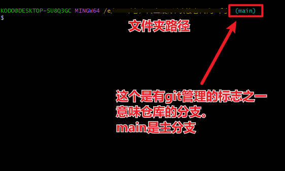

[回到主页](../index.html)

[toc]

# 1.0_git 基本使用

> [!warning]
>
> 作者并非高手，这是学习笔记。也建议在学习的同学自己做笔记巩固基础。
>
> 作者：隐鱼子

[GIT参考文档](https://blog.csdn.net/zamamiro/article/details/70172900)

[廖雪峰的博客](https://www.liaoxuefeng.com/wiki/896043488029600)

## 1.1_git 初始检查

下载git和安装git并不难，网上有很多教程。安装时可以按照默认值安装

第一次使用git需要看看是否具有ssh秘钥。

```shell
cd ~/.ssh
```

或者尝试连接github库

```shell
ssh -T git@github.com
```

如果没有秘钥，则会提示这个

没有ssh秘钥。那么就需要按照以下方式初始化git

```shell
NO such file or directory
```

若连上秘钥，则会跳转目录过去。

----------------------------

若连不上github。则没有配置过github库。就按照一切都没有的重新来过也可以。

如果连接上github了，会有个提示

```shell
Hi USER! You've successfully authenticated, but GitHub does not provide shell access.
//翻译
你好，用户名！您已成功通过身份验证，但 GitHub 不提供 shell 访问。
```

确认这个是自己的，正确的配置。则直接跳转到[1.4](1.4_git 配置对应的文件夹)


## 1.2_git 用户配置

设置用户名。你可以理解为提交者。

```shell
git config --global user.name "注册名"
```

例如`git config --global user.name "王二小"`

此处尽可能的和仓库平台一致

---

``` shell
git config --global user.email "注册邮箱"
```

例如`git config --global user.email "1234567891000@123.com"`

此处尽可能的和仓库平台一致

## 1.3_git 生成秘钥及配置秘钥

生成ssh

``` shell
ssh-keygen -t rsa -C "自己的邮箱"
```

例如``ssh-keygen -t rsa -C "1234567891000@123.com"``

此处尽可能的和仓库平台一致

这里我使用了新版本。他有一些配置可以选。

```shell
Generating public/private rsa key pair.
Enter file in which to save the key (/c/Users/PCNAME/.ssh/id_rsa):
Created directory '/c/Users/PCNAME/.ssh'.
Enter passphrase (empty for no passphrase):
Enter same passphrase again:
```

翻译就是

```shell
生成公钥/私钥 rsa 密钥对。
输入保存密钥的文件 (/c/Users/PCNAME/.ssh/id_rsa)：
已创建目录"/c/Users/PCNAME/.ssh"。
输入口令（无口令时为空）：
再次输入相同的口令：
```

生成之后在自己的目录文件夹里会出现几个文件

```shell
win + E
```

打开资源管理器。在目录里输入

```shell
%userprofile%\.ssh
```

可以打开一个叫**.ssh**的文件夹。里面有两个ssh文件

> id_rsa.pub 是公共钥匙
>
> id_rsa 是私人钥匙

打开公钥，全选其内容。复制下来。

打开[github](https://github.com/settings/keys)进入设置添加秘钥

点击新建ssh秘钥，粘贴刚才复制的秘钥。其他的秘钥也可以删除。

然后测试于github的连接，打开git

```shell
ssh -T git@github.com
```

输入之后弹出

```shell
The authenticity of host 'github.com (0)' can't be established.
ED25519 key fingerprint is SHA256:0
This key is not known by any other names.
Are you sure you want to continue connecting (yes/no/[fingerprint])?YES
Warning: Permanently added 'github.com' (0) to the list of known hosts.
Hi USER! You've successfully authenticated, but GitHub does not provide shell access.
```

``` shell
无法确定主机 "github.com (0) "的真实性。
ED25519 密钥指纹为 SHA256:0
此密钥没有其他名称。
您确定要继续连接吗（是/否/[指纹]）？YES(这里是用户手动输入的，输入完成后回车)
这里是回车之后弹出的新内容。
警告： 在已知主机列表中永久添加了 "github.com" (0)。
你好，USER！您已成功通过身份验证，但 GitHub 不提供 shell 访问。
```

以上，初始化基本上就完成了。


## 1.4_git 配置对应的文件夹

如果没有克隆下来。首先要在所需要的文件夹里面先安装git。

> 这里的安装不是安装git安装包。而是在文件夹配置git的基本配置
>
> 把这个文件夹编程GIT可以管理的仓库

``` shell
git init
```

安装完成之后会多一个`.git`的文件夹，它是用来跟踪管理版本库的。默认是隐藏文件夹。

在属于git管理库的文件夹内时，后面会多一个括号，括号内是分支名




## 1.5_git 克隆到本地

在上传配置比较难搞的时候，可以先考虑克隆，然后删掉自己不要的，拖入自己想要的。

```shell
git clone https://github.com/USER/store.git
//翻译
将克隆（仓库地址）至当前文件夹内
https://github.com/USER/store.git
https://github.com/用户名/仓库名.git
```


## 1.6_git 链接库


如果是空的库，可能要用这个

```shell
 git remote add origin git@github.com:USER/store.git
 //翻译
 将同步到远程添加仓库 （仓库地址）git@github.com:用户名/仓库名.git
```


## 1.7_git 上传

> [!tip]
>
> 如果上述工作完成之后。之后再这个目录就可以仅做这样的操作了。
>
> 如果您想省事儿，可以使用下列的shell脚本完成。但不建议初学者操作。、

```shell
git add .
```

这个是选中当前目录所有文件。（全选。好同步）

```shell
git commit -m'更新内容说明'
```

这个是把项目提交到仓库，并添加更新说明

> 此处仓库是GIT记录的本地仓库。并非同步到远程仓库（github）等

``` shell
git push -u origin master
```

如果新建的远程仓库是空的，所以要加上-U这个参数，等远程仓库里面有了内容之后，下次再从本地库上传内容的时候只需下面这样就可以了：

``` shell
git push origin master
```

以上的master为分支。main也是分支，上传到哪个就写哪个

# 2.0_shell脚本自动部署

shell脚本是一种自动部署的方式，懒人方式。但很方便。缺陷也很多，例如。更新说明就等于没有了。

## 2.1_解释shell脚本文件

这个文件为一个

## 2.2_创建shell脚本文件

需要创建一个`文件名.sh`的文件。例如`upload.sh`

用编辑器打开文件。以下我将展示一个便携完成的shell

```shell
# 使用此脚本。需要配置好所有的配置文件
# 然后再git页面内 ./upload.sh


# 自动更新部署
git add .
# 记得更改提交信息
git commit -m '测试上传'
# git push
# 上传到远程仓库中的main分支
git push origin main

```


## 2.3_执行shell脚本

在对应的目录下。使用git打开文件夹。

在终端页面输入

`./upload.sh`

回车之后即可执行

## 参考文档

>[GIT参考文档](https://blog.csdn.net/zamamiro/article/details/70172900)
>[廖雪峰的博客](https://www.liaoxuefeng.com/wiki/896043488029600)
